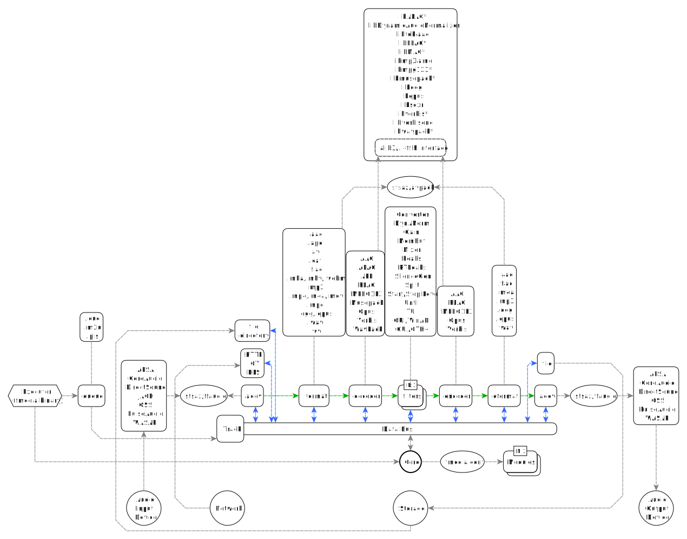
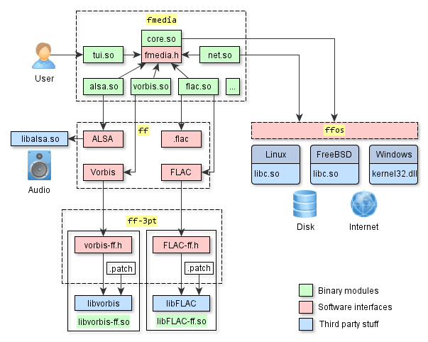
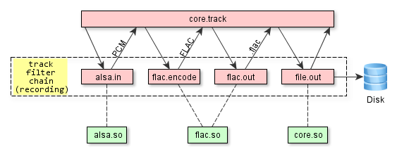

# Architecture of fmedia

This article explains several key aspects of fmedia architecture.

## Top-level diagram

The latest (Oct 2022) top-level diagram:

## Old diagram

Here's a little bit outdated (Apr 2018) diagram and its description.

Representation of the code structure at high-level:

This is a simplified diagram that shows several fmedia modules, their dependencies on third-party libraries and software interfaces that connect them to each other.  I chose not to include all modules here because this will overwhelm the picture.  Instead, I focus on several distinct modules and key aspects.  Everything else works exactly the same way.

fmedia is built from 4 source code repositories (fmedia, ff, ff-3pt, ffos) and also has many dependencies on third-party libraries.  Splitting by separate repositories is better because "ff" libraries can be reused by any other application, thus leaving "fmedia" the only repository that contains application-specific details and business logic.

Contents:

* [ff-3pt](#ff-3pt)
* [ffos](#ffos)
* [ff](#ff)
* [fmedia](#fmedia)

## ff-3pt repo

ff-3pt repository contains APIs, patches and build scripts for several useful third-party libraries that implement complex algorithms, such as audio processing and data compression.  Originally, these libraries have different APIs that are sometimes inconvenient to use, and sometimes they lack support for asynchronous I/O.  The APIs, that are shown on the diagram as red boxes, solve these problems as they are compiled into the libraries.  This approach allows to throw away the unneeded code during compilation process making the binaries a little bit smaller.  But in some cases, to get the job done, the original code must be modified: that's what patches in this repository are for.  So, to sum things up: the original code of third-party libraries + additional patches + new compiled-in APIs = smaller binary modules that are easier to use.

ff-3pt repository provides an easy access to third-party libraries via clean API: [https://github.com/stsaz/ff-3pt](https://github.com/stsaz/ff-3pt)

## ffos repo

FFOS library allows to write cross-platform code for Linux, FreeBSD, macOS and Windows.  It contains lightweight interfaces and wrappers around low level system functions, such as memory allocations, file and socket I/O, etc.  With FFOS, the code is written once but can compile on any platform: much effort was applied to unify POSIX API and Win32 API into one API which is both simple and efficient.  FFOS layer is very thin, and the resulting code produced by C compiler is optimized as if native OS userspace interfaces were used directly (`libc.so` on UNIX, `kernel32.dll` on Windows).  In other words, FFOS is so fast that the only way to make it faster is by using direct `syscall()` (i.e. not using libc at all).

FFOS is a fast and independent library for writing cross-platform code: [https://github.com/stsaz/ffos](https://github.com/stsaz/ffos)

## ff repo

FF library contains functions for a very large set of technologies, from the fast C arrays to parsers of multimedia containers and file archives.  Its purpose is to provide an application with an easy-to-use API to work with a given technology.  On the diagram, there are interfaces to work with:

* ALSA library

	This API is based upon the low level `libalsa.so` interface which provides access to system sound devices: control device, playback and capture audio.  In source code, these are the functions that start with `ffalsa_` prefix and that are similar to Pulse, WASAPI and other APIs.

* Vorbis audio compression

	This functionality is for encoding and decoding audio with Vorbis and it's based upon the `libvorbis` interface from *ff-3pt*.  In source code, these are the functions that start with `ffvorbis_` prefix and that are similar to FLAC, MPEG and other APIs.

* .flac file format

	Reads and writes meta data and FLAC frames from/to .flac container.  In source code, these are the functions that start with `ffflac_` prefix and that are similar to .ogg, .mp3 and other APIs.  This code is written from scratch, it's small and optimal, supports asynchronous I/O, and it doesn't depend on libFLAC.  The reason for this is that audio container and audio compression algorithm are two different things and must have separate independent APIs.

* FLAC audio compression

	This functionality is for encoding and decoding audio with FLAC and it's based upon the `libFLAC` interface from *ff-3pt*.

FF is based upon FFOS, so its code runs on any platform.
There is much more functionality in FF than what's described here, the complete list of features is in README file: [https://github.com/stsaz/ff](https://github.com/stsaz/ff)

## fmedia repo

This is the project repository - [https://github.com/stsaz/fmedia](https://github.com/stsaz/fmedia), it contains the code of all modules and the supporting files.  The list of modules to load and their settings are read from `fmedia.conf` file at fmedia startup.  After the modules are loaded, `fmedia` executable passes the commands from command-line to core module to start playback, recording or conversion.  The core module creates a track and starts the processing.  All modules interact with each other through interfaces described in `fmedia.h` ([https://github.com/stsaz/fmedia/blob/master/src/fmedia.h](https://github.com/stsaz/fmedia/blob/master/src/fmedia.h)) file:

* Indirectly: when modules act as filters within the track chain, they don't need to interact in any way with their neighbours: they just do their small piece of work and return.  More details are below in the description of `core.so` module.

* Directly: in some cases the modules need to call each other's functions directly.  The first step is to get the necessary interface from core by the name of module.  And the second step is to call the appropriate functions from this interface.

		modA                        core             modB
		 |                           |                |
		 |- (get modB's interface) ->|                |
		 |<--- (modB's interface) ---|                |
		 |                                            |
		 |----------- (call modB function) ---------->|

On the diagram, the green boxes are the modules binary files:

* core.so

	It's the main module, it runs the worker loop which processes tasks from all modules and events from system queue.  It also contains several internal submodules for asynchronous file I/O, audio conversion, tracks queue etc.

	But the main functionality here is the audio track processor, which manages the chain of filters for an audio track.  It allows other modules to dynamically add and remove filters to/from the chain.  After it has called a filter, which processes the input data and returns the output data, it goes forward through the chain and passes this data to the next filter, or it goes back through the chain and asks the previous filter to return more data.  This process repeats until the last filter in chain completes its work.

	

	There is no limit on the amount of tracks that may run in parallel, it depends only on system resources.  But in theory, while recording from many audio devices at once, the capture buffer of neighbour track may overrun while one chunk of audio data is being compressed.

* tui.so

	This is a Terminal UI - it executes commands from stdin, such as 'play next file' or 'seek forward by 5 sec'.  It also prints the information about the currently playing track and the current audio position:

		"Ozzy Osbourne - Dreamer" 03 - Dreamer.mp3 10.88 MB, 4:44.906 (13,675,520 samples), 320 kbps, MPEG, 48000 Hz, float32, stereo

		[=================.....................................................] 1:13 / 4:44

* net.so

	This module contains HTTP and ICY client to read data from Shoutcast streaming Internet servers.  When saving songs from radio, this module dynamically creates a new child track and passes the data to it.  At the same time, the main track continues to play the data through the speakers.

		track #1:  net.http -> net.icy -> mpeg.decode -> alsa.out
		(playback)                     \
		                                \
		track #2:                        -> net.in -> mpeg.copy -> file.out
		(copy data to disk)

* vorbis.so, flac.so, etc.

	These modules read and write data from/to media containers and decode or encode audio data.  These modules are based on FF and what they actually do is they call the appropriate functions from FF in a loop: provide the input data from the previous module and pass the returned data to the next module in chain.

		track #1:    file.in -> flac.decode -> (...sound processing...) -> vorbis.encode -> ogg.out -> file.out
		(audio
		conversion)

### Configuration and Portability

Another thing that's worth mentioning here is fmedia configuration file, mainly `fmedia.conf`.  This is what it looks like:

	...
	mod_conf "#globcmd.globcmd" {
		pipe_name fmedia
	}

	mod_conf "#file.in" {
		buffer_size 64k
		buffers 3
		# align 4k

		# use direct I/O
		direct_io true
	}
	...

Full version is here: [https://github.com/stsaz/fmedia/blob/master/fmedia.conf](https://github.com/stsaz/fmedia/blob/master/fmedia.conf)

`mod_conf` is a keyword that adds a new module with settings.  Module names starting with '#' prefix are compiled into `core.so`.  Unless the module is in this configuration file, it won't be loaded and can't be used at runtime.  And because of this it's possible to re-package fmedia in any way: you can delete all codec modules and remove them from `fmedia.conf` and you'll have a very small and portable package that you can use for recording into .wav format, for example.  Also, this is the one more reason why fmedia uses codecs built by ff-3pt and doesn't use default codecs that are installed with the UNIX OS: it would not be portable.  Now fmedia package can be copied anywhere and it's ready to run - this is very convenient!

## Conclusion

I hope I explained and showed enough details for a high level overview of fmedia's architecture.  If you still have questions, just email me.
