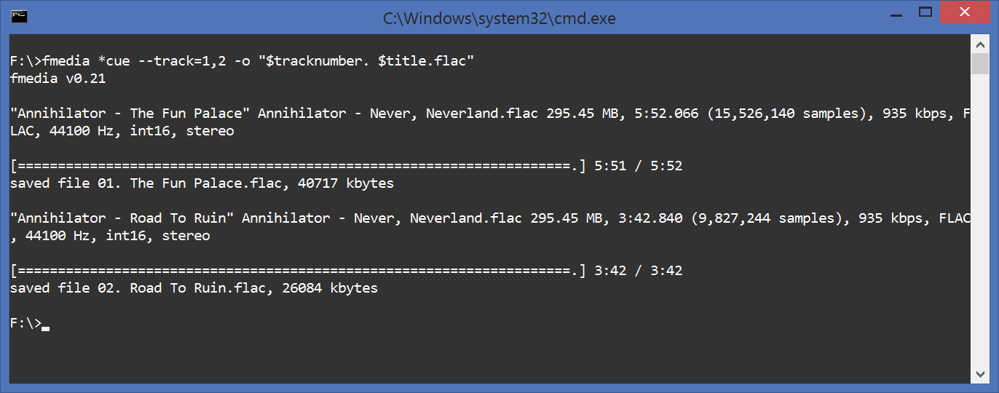
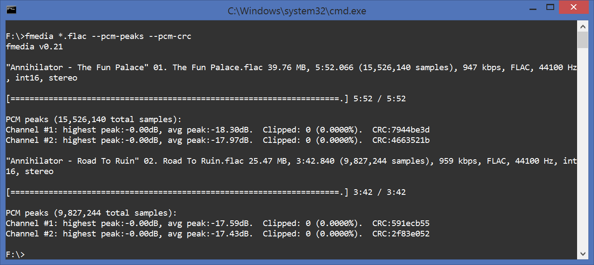

# How To Convert Audio Files

by Simon Zolin, Dec 7 2016 (upd. Dec 11, 2016)

In this article I'm gonna show you how to convert audio files on Linux and Windows.  The document explains how to encode into lossy and lossless audio formats such as MP3, AAC, FLAC and others.  It also explains how to accurately extract audio files from CUE sheet.  In the end of this tutorial I'll show how to copy audio data without re-encoding.

## Contents:
* [Quick Start](#quickstart)
* [Encoder Settings](#enc_sett)
* [Batch Convert](#batch)
* [Extract From Cue Sheet](#cue)
* [Copy And Process Audio](#copy)

## QUICK START

Converting audio files with fmedia is very easy, just take a look at this example:

	fmedia file.wav -o file.mp3

This command will convert file.wav into MP3 format.  fmedia determines output format by file extension you specify.  Use .mp3 to encode into MP3, use .flac to encode into FLAC, and so on.

## ENCODER SETTINGS

In the previous example, the audio data is encoded into MP3 using the default settings, configured in fmedia.conf.  Here's how you can explicitly specify MPEG quality setting to encoder:

	fmedia file.wav -o file.mp3 --mpeg-quality=192

This instructs fmedia to use 192kbit/sec bitrate for the new MP3 file.  And if you'd like to use VBR instead, do it like this:

	fmedia file.wav -o file.mp3 --mpeg-quality=2

Now file.mp3 will be encoded with VBR algorithm using V2 setting, which is ~190kbit/sec for audio CD data.

Using this method you can simply convert between all audio files supported by fmedia.  You can find out more about different encoder settings, that you can specify in command line, if you run `fmedia --help`.

### Default settings

But in case you usually convert audio files with the same quality settings, it's more convenient to change the default settings, than to pass `--mpeg-quality` every time.  Here's how you can do this.  Open `fmedia.conf` file in your text editor, find section `mod_conf "mpeg.encode"`, and change `quality` setting to whatever you like.  For example:

	mod_conf "mpeg.encode" {
	# VBR quality: 9..0 or CBR bitrate: 64..320
	quality 320
	...

From now on, fmedia will use 320kbit/sec bitrate by default for all future encoded MP3 files.

## BATCH CONVERT

If you have many files you want to convert, you don't need to execute fmedia multiple times, you need just one command:

	fmedia ./Music/*.wav -o './Encoded/$filename.ogg'

fmedia will find all WAV files inside `./Music/` directory (not in its sub-directories), and convert each of them into OGG Vorbis.  Note that I use `$filename` variable here instead of the actual file name.  fmedia will automatically substitute `$filename` with the file name (without extension) of each .wav file.  So, for example, if you have file `./Music/song1.wav`, it will be converted into `./Encoded/song1.ogg`.  You can use all other supported $-variables too, see `fmedia --help` for more.

Here's another example:

	fmedia ./Music/ -o '$filepath/$filename.ogg'

Here fmedia will search for any supported audio files inside `./Music/` directory, including sub-directories and convert them.  `$filepath` will be substituted with the original file path, so `./Music/Artist/Song.wav` will be converted into `./Music/Artist/Song.ogg`.

## EXTRACT FROM CUE SHEET

If you need to copy one or several tracks from .cue sheet file, use this command:

	fmedia album.cue --track=1,3,5 -o '$tracknumber. $artist - $title.flac'

Here fmedia will parse .cue file, select tracks #1, #3 and #5 from it, and convert them into FLAC.  fmedia is 100% accurate extractor and if the source is lossless (e.g. FLAC), FLAC->FLAC conversion won't result in any audio quality loss.  Also, contrary to some other similar tools, fmedia will produce files with the exact same length, as the original source, sample to sample.  All meta information from the CUE file will be preserved and copied into new files.

Note that I use `$tracknumber, $artist and $title` variables to automatically name new files.  However, if CUE file doesn't define meta tags, this command won't work as expected.  If it's the case, use a simple `'$tracknumber.flac'` instead.

### Meta

You may set (or overwrite) meta information when extracting from CUE, for example:

	fmedia album.cue --track=1,3,5 -o '$title.flac' --meta='artist=ArtistName'

New FLAC files will have meta tag `ARTIST` set to ArtistName, even if CUE sheet file defines `ARTIST` tag to another value.

### Extract from multiple .cue files

It's possible to process multiple CUE sheets with just a single command:

	fmedia album1.cue album2.cue album3.cue -o './$artist/$year - $album/$tracknumber. $title.flac'

This command will parse .cue files one by one and extract all tracks from them into current directory.  Output files will be automatically named from meta data, e.g. `./Jimi Hendrix/1967 - Are You Experienced/01. Purple Haze.flac`.

### Re-encode

If you wish to convert tracks directly to another format, you can use this command:

	fmedia album.cue --track=1,3,5 -o '$tracknumber. $artist - $title.m4a' --aac-quality=192

Here fmedia will convert tracks from CUE file to AAC using 192kbit/sec bitrate.

### Pre-gaps

You can configure or skip track pregaps, if you want to.  Use `--cue-gaps=N` parameter for this:

* `--cue-gaps=0`: skip pregaps:

		track01.index01 .. track02.index00

* `--cue-gaps=1`: (default), gap is added to the previous track:

		track01.index01 .. track02.index01

* `--cue-gaps=2`: gap is added to the previous track (but track01's pregap is preserved):

		track01.index00 .. track02.index01
		track02.index01 .. track03.index01

* `--cue-gaps=3`: gap is added to the beginning of the current track:

		track01.index00 .. track02.index00

## COPY AND PROCESS AUDIO

### Copy without re-encoding

You may copy OGG or MP3 streams as-is, without re-encoding.  For example:

	fmedia file.mp3 --stream-copy --seek=1:00 --until=2:00 -o file-cut.mp3

This command will copy MP3 audio data from 1:00 to 2:00 into a new file.  This new file will have the exact same quality as the source.  Note however, that seeking may not always be accurate, so always check the output file.

### Advanced conversion

The command below will show how to order fmedia to do more advanced audio processing:

	fmedia file-int24-48000.flac --format=int16 --rate=44100 --gain=6 -o file-int16-44100.flac

In this example, the input FLAC file with 48kHz/24bit format will be converted into FLAC file with 44.1kHz/16bit format (Audio CD quality).  `--gain=6` parameter is used to apply gain +6.0dB, because the audio in input file is too quiet.

### Audio data checksum

It's sometimes useful to check whether lossless conversion is accurate.  You can use fmedia to check that:

	fmedia *.flac --pcm-peaks --pcm-crc

It will print PCM peaks information along with CRC for each audio channel.

## CONCLUSION

I've described several useful commands that can be used to convert audio files.  You can use many different combinations of parameters to fmedia, see `fmedia --help`.  And don't forget to always check your output files to ensure they sound as expected, especially if you intend to delete the source files.  If you have any questions or suggestions, please send me a message.
