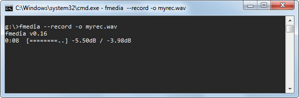
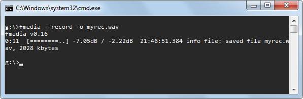
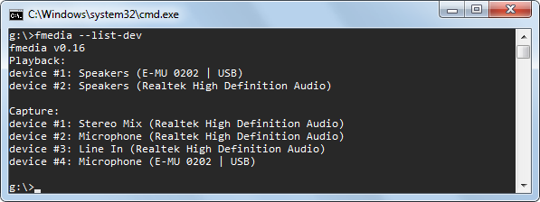
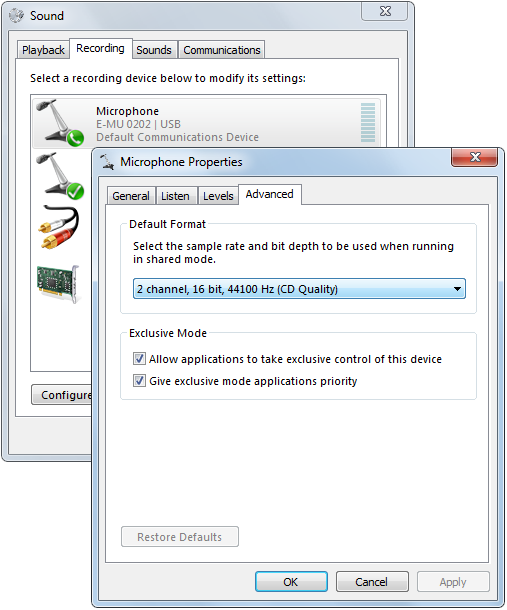
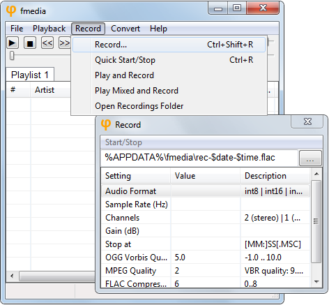

# How To Easily Record Sound On Windows And Linux

by Simon Zolin, Aug 25 2016 (upd. Feb 13, 2018)

In this tutorial I'm going to show you how to record audio using fmedia.  The article covers several aspects: choosing audio capture device, configuring audio settings and saving recorded audio to a file.  First I describe how to use fmedia from command line on both Windows and Linux, and then how to use fmedia GUI supported only on Windows.

## Contents:
* [Quick Start](#quickstart)
* [Choosing Audio Input Device](#device)
* [Setting Default Audio Input Device](#defdevice)
* [Configuring Audio Format](#format)
* [Configuring Audio Settings On Windows](#winformat)
* [Setting Default Audio Format](#defformat)
* [Choosing Output File Format](#output)
* [Recording to Standard Output](#stdout)
* [Record from Playback ("What You Hear")](#loopback)
* [Controlling From Another Process](#globcmd)
* [Recording While Playing](#recnplay)
* [Recording With GUI](#recgui)
* [Recording From Internet Radio](#radio)

## QUICK START

Before we start using more advanced features, I want to show you the easy way how to record sound from your default audio input device to a file.  Just execute the following command:

	fmedia --record -o myrec.wav

The recording process starts and the output file "myrec.wav" is being filled with audio data.  The dB values show how loud your current signal is.  If it reaches 0dB, your signal is too loud and it will be clipped, resulting in quality loss.  Usually, the best recording quality is achieved when the sound level is almost 0dB, but not reaches it.

To stop recording, press `Ctrl+C` or just `S` (the default key for "Stop").  All cached data is flushed to a file and fmedia exits.  fmedia can automatically stop recording after the given time is passed: use `--until=MIN:SEC` parameter when executing fmedia.

Note that this method may not work if the default audio format configured in fmedia isn't compatible with your audio device.  Also, you might want to use another audio device, not the one configured in your OS as the default.  The next sections of this tutorial will show you how to do that.

Note Linux users: fmedia uses ALSA for audio streaming, so if your system doesn't have ALSA installed and configured, sound recording won't work.

## CHOOSING AUDIO INPUT DEVICE

Without any additional configuration fmedia will use audio device configured in your OS as the default.  But what if you want to use another device?  There are 2 simple steps you should follow:

* Get the list of sound devices.
* Choose the needed device and pass it to fmedia.

### Step 1.
This command shows the list of all available sound devices in your system:

	fmedia --list-dev

### Step 2.
You should pick a device you want to use from "Capture" section and pass its number to fmedia.  For example, if I want to record from my USB soundcard, I run fmedia like this:

	fmedia --dev-capture=4 --record -o myrec.wav

Now the sound will be recorded from "Microphone (E-MU 0202 | USB)".

## SETTING DEFAULT AUDIO INPUT DEVICE

If you don't want to specify `--dev-capture=N` parameter each time you run fmedia, you can set this device to be used by fmedia by default.  You need to edit fmedia.conf file and configure the module which is used for sound recording.

On Windows, find this section:

	mod_conf "wasapi.in" {
		device_index 0
	...

and set another device number instead of "0".

On Linux, do the same in this section:

	mod_conf "alsa.in" {
		device_index 0
	...

## CONFIGURING AUDIO FORMAT

Default audio format used by fmedia for sound recording is audio-CD quality (16-bit, 44.1kHz, stereo).  But it isn't always the best choice.  You may wish to set different audio settings: bit depth, sample rate, channels.  Consider this example:

	fmedia --record --format=int24 --rate=48000 --channels=mono -o myrec.wav

This command starts recording in 24-bit format, 48kHz sample rate, 1 channel.
The supported formats, that can be used with `--format` switch, are: int8, int16, int24, int32, float32.

Note Windows users: the audio settings you pass here to fmedia may not be compatible with the format configured in Windows.  In this case sound conversion will occur possibly resulting in a quality loss.  The next section explains how to configure your audio device recording format.

## CONFIGURING AUDIO SETTINGS ON WINDOWS

Here are the steps to set audio format used by Windows for the recording device:

* Right click on Speaker icon in system tray.
* Choose "Recording devices" in the popup menu.
* Double click on the device you want to configure.
* Select "Advanced" tab.
* In section "Default Format" select the needed format.
	It is best if this format matches with fmedia audio format settings.
* Press OK to save settings.

## SETTING DEFAULT AUDIO FORMAT

You may configure fmedia to use different audio format by default, rather than audio-CD quality.  Open fmedia.conf in your text editor, then find this section:

	# Default audio format for recording
	record_format {
		# Audio format: int8 | int16 | int24 | int32 | float32
		format int16
		# Channels number: 2 (stereo) | 1 (mono) | left | right
		channels 2
		rate 44100
	}

and set the audio format you want fmedia to use by default.  After that you don't need to specify `--format`, `--rate` and `--channels` parameters every time.

## CHOOSING OUTPUT FILE FORMAT

To record into another file format, just specify its file extension as the output file.  For example, to use FLAC:

	fmedia --record -o myrec.flac

You can use any output file format supported by fmedia: wav, flac, ogg, mp3, m4a.

I recommend you to use FLAC for lossless audio recording.  CPU usage is really small for FLAC encoding, so don't be afraid to use it.  But be aware that fmedia can't encode 32-bit or float audio to FLAC.

If you need the fastest possible recording and you don't need to save disk space, use WAV format.  It supports any audio format and requires zero encoding time.

When you want to save disk space and the best audio quality isn't required, use OGG Vorbis for lossy audio recording.  The default setting 5.0 for Vorbis encoding quality gives a good starting point.

## RECORDING TO STANDARD OUTPUT

fmedia can also write recorded audio into stdout.  It may be useful if you want to immediately pass fmedia's output to another program.  Here's an example:

	fmedia --record --out=@stdout.wav > ./my-rec.wav

Here fmedia writes recorded data into stdout, and then it's being redirected to a file my-rec.wav.  When `--out=@stdout` argument is specified, fmedia writes output to stdout, instead of a file.  File extenstion (.wav in this case) for `--out` parameter must be specified, so fmedia knows what output file format to use.

You can use another application to process recorded audio:

	fmedia --record -o @stdout.wav | your_audio_app OPTIONS

You may also use fmedia to read audio from stdin:

	fmedia --record -o @stdout.wav --until=5 | fmedia @stdin.wav -o rec.wav

Keep in mind that since stdout is an unseekable stream, recorded output files may have incomplete headers.  Currently, only .wav, .flac, .ogg/.opus are supported for stdout streaming.

## RECORD FROM PLAYBACK ("WHAT YOU HEAR")

On Windows, WASAPI has an ability to capture audio from playback device, it's called loopback mode.  You can easily capture the sound you hear from your speakers with fmedia:

	fmedia --record --dev-loopback=0 -o rec.wav

`--dev-loopback=0` argument tells fmedia to use the default playback device and start recording from it.  You can use other device to record from, just specify its number instead of 0 (see [Choosing Audio Input Device](#device)).  Note that you need to specify a "Playback/Loopback" device and not a "Capture" device.

## CONTROLLING FROM ANOTHER PROCESS

fmedia can stop recording which was started from another instance of fmedia.  This can be useful if you don't have an ability to interact with a terminal where fmedia is running (i.e. you can't press "S" to stop recording).  This feature isn't enabled by default, you must pass `--globcmd=listen` command line argument to enable it:

	fmedia --record -o myrec.wav --globcmd=listen

This command starts recording audio and starts listening for commands that can be sent from another instance of fmedia.  You can now forget about this terminal window, where fmedia is currently running, and minimize it.  This would be instance #1.

When you want to stop recording, you execute fmedia once again (i.e. you start instance #2):

	fmedia --globcmd=stop

fmedia will find out that instance #1 is currently running and will issue a command to it to stop recording.  Both fmedia processes will now exit, with the first one correctly finishing its recording file (flushing all cached data and finalizing file header).  In other words, this command will simulate an "S" key-press action for the first instance.

There are other commands that `--globcmd` parameter supports, but currently they're useful for audio playback only.  See the output of `fmedia --help` to find out more.

## RECORDING WHILE PLAYING

fmedia can process multiple tracks running together.  If you need to record audio while still being able to play another track, use this command:

	fmedia track.mp3 --record -o myrec.wav

It will start playback of track.mp3 and in the same time start recording audio into myrec.wav.

Note that there may be a small time unsynchronisation between input tracks and your recorded file.  If you experience this problem, try reducing buffer size for modules "wasapi.in", "wasapi.out" (Windows) or "alsa.in", "alsa.out" (Linux).  However, at this time there's no 100% working solution for the issue.

Consider the next example:

	fmedia --mix track1.mp3 track2.mp3 --format=int16 --record -o myrec.wav

Here fmedia starts playback of both track1.mp3 and track2.mp3 simultaneously (mixing tracks together) and starts recording into myrec.wav.  `--format=int16` parameter is required because by default fmedia uses int16 audio format for mixer output, but mp3 output format is float32, thus audio conversion must be done.  Be careful when using `--mix` command: fmedia doesn't apply sound attenuation in this case, so the output signal may be very loud.

## RECORDING WITH GUI

On Windows there is a graphical interface for fmedia you can use for recording.  Of course command-line interface has its advatages but recording with GUI is even easier!

Run fmedia-gui and from the main window press `Ctrl+R`.  The recording process will start to a new file.  To stop recording, press `Ctrl+R` once again.  Also, you can start and stop recording by clicking on `Record` menu and then `Quick Start/Stop`.  After recording is stopped, a new file will appear in the playlist.

If you wish to configure recording settings, you need to open Record window:

Here you select where to save your recordings, how to name them and which output file format they will be saved into (.flac in this case).  fmedia supports dynamic variables (e.g. `$date` and `$time`) that can free you from naming the files manually every time.  You can read about $-variables in help.txt file.

Empty value (e.g. for "Audio Format") means "use default".  You can change some of these settings in fmedia.conf in section `mod_conf "gui.gui"`.

## Recording From Internet Radio

fmedia can capture audio not just from sound input device but also from Internet radio stream.  You may choose to re-encode audio to a different format, or you may just save the original audio data as-is without re-encoding.  Let's start with a simple example:

	fmedia http://radio-stream:80/ -o ./radio.mp3

This command receives audio data from URL `http://radio-stream:80/`, converts it into MPEG Layer 3 with the default settings and saves it into `./radio.mp3` file on your disk.  It will keep recording until you press Stop.  But what if the stream is already in mp3 format and you don't want to lose the original quality by re-encoding?  Consider the next example:

	fmedia http://radio-stream:80/ -o ./radio.mp3 --stream-copy

By appending `--stream-copy` argument you order fmedia not to apply audio conversion mechanism, but rather just save the original stream as-is into a file.  Note that you must choose the appropriate output file extension in order for this to work: use .mp3 extension if radio stream uses MPEG Layer3 format;  use .m4a extension if radio stream uses AAC format.

What if you want not to just record but also listen to the radio at the same time?  Use `--out-copy` argument and you'll be able to listen to radio while saving its data to disk in parallel:

	fmedia http://radio-stream:80/ -o ./radio.mp3 --stream-copy --out-copy

### Artist/Title info

Many radio streams use ICY meta data to show Artist/Title information about the song currently being played.  You can use this to split radio stream into multiple named tracks on the fly:

	fmedia http://radio-stream:80/ -o './$time. $artist - $title.mp3' --stream-copy --out-copy

We use dynamic $-variables here, so we don't need to write any meta data by hand - this is done automatically.  Whenever radio stream changes meta data information, fmedia will finish recording to the current file and start writing to a new one with the fresh Artist/Title info.  For the previous command line your files will be named like this: `./123456. The Great Artist - Super Song.mp3`

What if you don't want to store every track on disk, but rather store only the tracks you like?  fmedia allows you to do that:

	fmedia http://radio-stream:80/ -o './$time. $artist - $title.mp3' --stream-copy --out-copy=cmd

While you're listening to a song, you may hit 'T' (i.e. `Shift+t`), and the currently playing song will be stored on your disk.  When a new track starts, this command is reset.  All other tracks won't be saved unless you press 'T' key for each one.

## CONCLUSION
So this is how you can record audio with fmedia.  I hope this article was helpful.  If you have any questions, send me an email.
